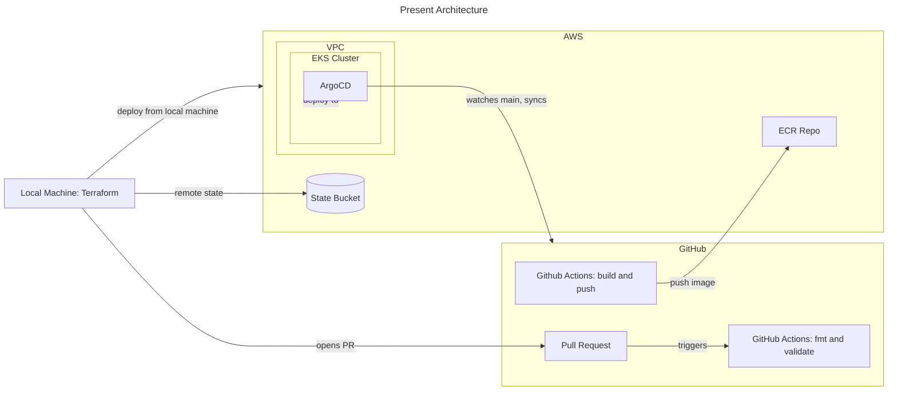

# production-ai-platform

End-to-end AI agent and RAG platform on AWS: Terraform, EKS, ArgoCD, FastAPI, Anthropic API, with observability and evals.

## Architecture

## Stack
- Infrastructure: Terraform, AWS (S3, ECR, EKS)
- Delivery: GitHub Actions, ArgoCD
- App: FastAPI (Python)
- AI: Anthropic API (direct)
- Observability: Prometheus, Grafana

## Running locally
_Will fill in once there is an app to run._

## Phase log
- 06-26-2026  Bootstrap: remote state backend on S3 with native lockfile locking.
- 06-27-2026  Shared: single ECR repository, promoted across envs by SHA tag.
- 06-27-2026  Shared: OIDC provider that allows GHA aws access.
- 06-30-2026  .github/workflows: GHA CI workflow, builds and pushes to ECR
- 07-02-2026  Shared: VPC, IGW, subnets, NAT, rt tables
- 07-05-2026  dev: hand-rolled EKS cluster, node group, pod identity agent, EBS CSI driver, AWS-LBC, metrics server
- 07-05-2026  dev: ArgoCD deployed via Helm
- 07-10-2026  deploy/: first end-to-end GitOps sync. Placeholder image built by CI,
              pushed to ECR, deployed to the cluster by ArgoCD from git. The spine
              is connected: code -> CI -> ECR -> git -> ArgoCD -> EKS.
- 07-10-2026  Docs: directory-level READMEs for vpc, ecr, iam, envs/dev, deploy.
              Architecture diagram updated to present state. Tagged v0.2.0.
- 07-11-2026  monitoring: kube-prometheus-stack (Prometheus, Grafana, Alertmanager,
              node-exporter, kube-state-metrics) deployed via ArgoCD Helm source.
              Required ServerSideApply=true, the chart's CRDs exceed the 262KB
              annotation limit that client-side apply relies on.
- 07-11-2026  .github/workflows: Terraform CI restructured into three jobs
              (changes / terraform / terraform-gate). The gate always runs so a
              path filtered required check can never deadlock a PR.
- 07-13-2026  Started the Knowledge Service, a FastAPI application that will become an
              incident knowledge base. I Set up the project with uv using a src layout so
              the package is installed and imported the way production does it, and
              exposed a single /health endpoint. The health check deliberately touches
              no dependencies, because a liveness probe that queries the database will
              report a healthy pod as dead during a transient database blip and
              Kubernetes will kill it.
- 07-13-2026  Wrote a multi stage Dockerfile for the service. The build stage installs
              dependencies from the lockfile before the source is copied, so editing
              application code does not invalidate the dependency layer and rebuilds
              stay fast. The runtime stage copies only the built virtual environment and
              the source, runs as a non root user, and puts the venv on PATH so uvicorn
              runs directly without uv present in the final image.
