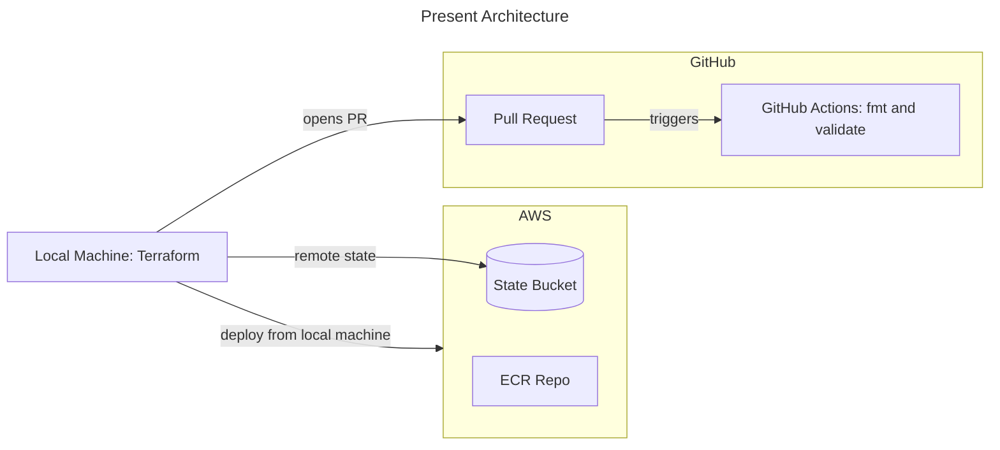

# production-ai-platform

End-to-end AI agent and RAG platform on AWS: Terraform, EKS, ArgoCD, FastAPI, Anthropic API, with observability and evals.

## Architecture

## Stack
- Infrastructure: Terraform, AWS (S3, ECR, EKS)
- Delivery: GitHub Actions, ArgoCD
- App: FastAPI (Python)
- AI: Anthropic API (direct)
- Observability: Prometheus, Grafana

## Running locally
_Will fill in once there is an app to run._

## Phase log
- 06-26-2026  Bootstrap: remote state backend on S3 with native lockfile locking.
- 06-27-2026  Shared: single ECR repository, promoted across envs by SHA tag.
- 06-27-2026  Shared: OIDC provider that allows GHA aws access.
- 06-30-2026  .github/workflows: GHA CI workflow, builds and pushes to ECR
- 07-02-2026  Shared: VPC, IGW, subnets, NAT, rt tables
- 07-05-2026  dev: EKS, ArgoCD, AWS-LBC, csi-driver, pod identity, metrics server
