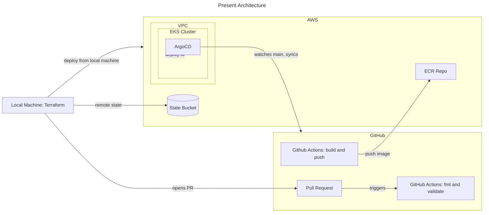

## Architecture

```mermaid
---
title: Present Architecture
---
flowchart LR
    Dev[Local Machine: Terraform]

    subgraph GitHub[GitHub]
        direction LR
        PR[Pull Request] --triggers--> GHA[GitHub Actions: fmt and validate]
        GHAB[Github Actions: build and push]
    end

    subgraph AWS
        direction TB
        S3[(State Bucket)]
        ECR[ECR Repo]
        subgraph VPC
            subgraph EKS[EKS Cluster]
                Argo[ArgoCD]
            end
        end
    end
    Dev -->|remote state| S3
    Dev -->|deploy from local machine| AWS
    Dev -->|opens PR| PR
    GHAB -->|push image| ECR
    Argo --> |watches main, syncs| GitHub
    Argo --> |deploy to| EKS

```
