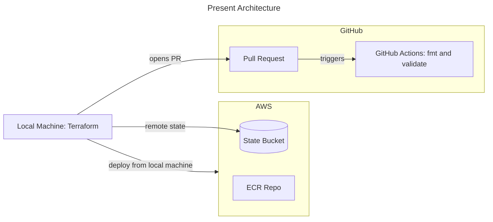

## Architecture

```mermaid
---
title: Present Architecture
---
flowchart LR
    subgraph AWS
        direction TB
        S3[(State Bucket)]
        ECR[ECR Repo]
    end
    subgraph GitHub[GitHub]
        direction LR
        PR[Pull Request] --triggers--> GHA[GitHub Actions: fmt and validate]
    
    end
    Dev[Local Machine: Terraform] --remote state--> S3
    Dev[Local Machine: Terraform] --deploy from local machine--> AWS
    Dev[Local Machine: Terraform] -->|opens PR| PR
    
```